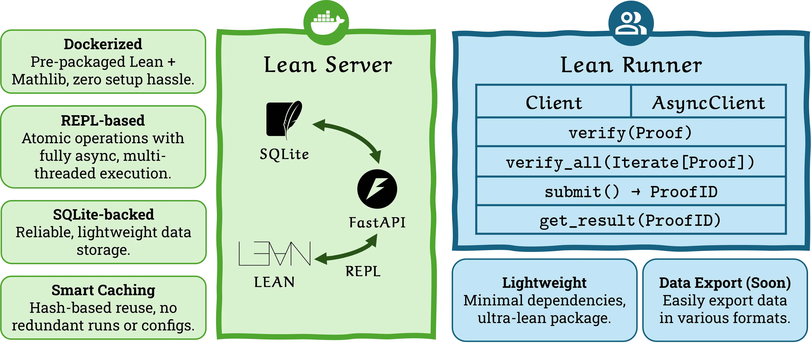
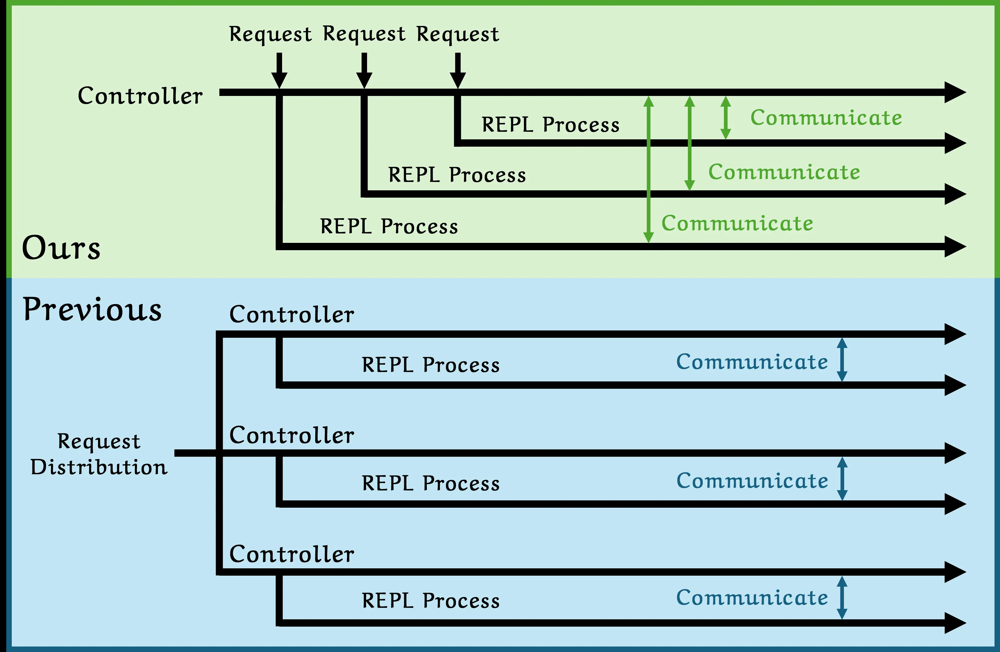

<style>
  .md-typeset h1 {
    display: none;
  }
</style>


<div align="center" markdown>

[](https://github.com/EvolvingLMMs-Lab/lean-runner)
[](https://pypi.org/project/lean-server/)
[](https://pypi.org/project/lean-runner/)
[](https://hub.docker.com/r/pufanyi/lean-server)

[](https://www.python.org/downloads/release/python-3120/)
[](https://lean-lang.org/doc/reference/4.22.0-rc4/releases/v4.22.0/)
[](https://github.com/leanprover-community/mathlib4/releases/tag/v4.22.0-rc4)
[](https://fastapi.tiangolo.com)
[](LICENSE)

<br/>

</div>

<div class="grid cards" markdown>

-   :material-rocket-launch: __Plug & Play__

    ---

    Get started in minutes with :material-docker: [Docker](https://www.docker.com/)'s one-click server setup. Our intuitive client abstracts away complex implementation details, letting you focus on what matters—your Lean proofs.

-   :material-rabbit: __High Performance__

    ---

    Leverages [REPL](https://github.com/leanprover-community/repl)-based atomized execution with fully asynchronous, multi-threaded architecture to maximize CPU utilization and throughput. Efficient interaction with the client using :simple-fastapi: [FastAPI](https://fastapi.tiangolo.com/).

-   :material-shield: __Robust & Reliable__

    ---

    Persistent :simple-sqlite: [SQLite](https://www.sqlite.org) logging ensures your work is never lost. Built-in crash recovery and automatic retry mechanisms eliminate the frustration of interrupted workflows.

-   :material-swap-horizontal: __Flexible Access Patterns__

    ---

    Choose between synchronous and asynchronous clients depending on your use case, from interactive development to large-scale batch processing.

-   :material-recycle: __Smart Caching__

    ---

    Intelligent content-based hashing ensures identical Lean code is processed only once, dramatically reducing computation time for repeated operations.

-   :material-chart-line: __Data Export & Visualization (Soon)__

    ---

    Easily export data in various formats (Hugging Face, JSON, XML, Arrow, Parquet) and visualize queries with a simple CLI.

</div>

## Why Server-Client?

Lean-Runner leverages a powerful Server-Client architecture that smartly places all the complex configuration on the server side, while keeping the client implementation elegantly minimal. We've packaged the entire server using :simple-docker: [Docker](https://www.docker.com/), making deployment incredibly straightforward and hassle-free.



## Why Async?

Lean-Runner's asynchronous architecture uses a **single centralized controller** to manage multiple REPL processes, unlike traditional systems that distribute requests across multiple controllers. This design delivers superior performance through concurrent execution, better resource utilization, and direct communication channels. The centralized approach reduces overhead, and enables intelligent load balancing. This scalable architecture allows you to dynamically add more REPL processes as needed, making it perfect for both interactive development and large-scale batch processing of Lean proofs.



## Citation

```bibtex
@misc{fanyi2025leanrunner,
    title={Lean-Runner: Deploying High-Performance Lean 4 Server in One Click},
    author={Fanyi Pu, Oscar Qian, Jinghao Guo, Bo Li},
    year={2025},
    publisher={GitHub},
    howpublished={\url{https://github.com/EvolvingLMMs-Lab/lean-runner}},
}
```
